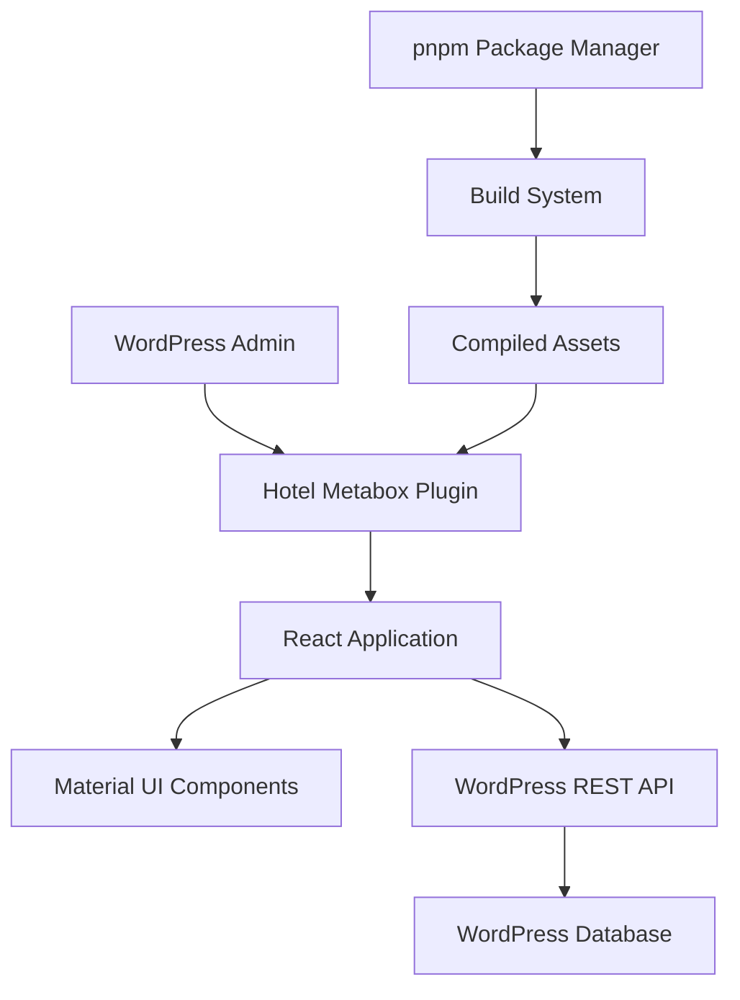

# Design Document

## Overview

The WordPress Hotel Metabox will be a React-based interface integrated into the WordPress admin panel for managing hotel information. It will allow users to add, edit, and delete hotel details such as room types, amenities, contact information, and pricing. The metabox will utilize Material UI for a consistent and modern design. Initially it was planned to use ACF, but later we decided to go with custom metabox and custom fields, so we need synchronization from ACF fields to our React app for existing posts.

## Tech Stack
- pnpm
- React 18+
- PHP (WordPress)
- MySQL 8+
- PHP 8.1

## Code Approach
- Use React for admin UI.
- For frontend use vanilla CSS/JS.
- Use PHP for backend logic.

## Admin UI
- @mui for UI components
- Use icons from @mui/icons-material
- DnD Kit for drag-and-drop functionality
- Framer Motion (pnpm add motion)
- Use react-select for async and multi-select dropdowns. 


## Architecture

### 📁 Project Structure

- Separate concerns clearly:

/plugin-name
  /includes
	(php logic files)
  /assets
    /css
	/js
	/img
	/dist
  /src (React)
    /components
    /hooks
    /store
    index.ts
  plugin-name.php

- Use **REST API** to decouple frontend and backend.

### High-Level Architecture



### Component Structure

See in /src/adminTruskavetsk.js - there are 4 Tabs (Sections/and their Rooms, Tariffs, Seasons, Prices)

### ⚛️ React Best Practices

- Bundle React app using **Vite**.

### Data Flow

1. WordPress loads the metabox when editing hotel posts
2. React application initializes with existing hotel data from WordPress meta fields
3. User interactions update local React state
4. Form submission saves data back to WordPress meta fields via AJAX
5. WordPress handles data persistence and validation

### ⚡ Performance
- Lazy-load routes/components with `React.lazy()` and `Suspense`.
- Use `React.memo()`, `useMemo()`, `useCallback()` wisely.
- Avoid anonymous functions inside TSX where possible.

### 🧼 Code Quality
- Use **TypeScript**.
- Apply **ESLint** and **Prettier**.
- Use custom hooks for logic-heavy components.

### 📦 State & Data
- Keep **local state** for UI logic.
- Use **TanStack Query** for async data fetching and caching.

### ✅ Components
- Prefer **functional components** with hooks.
- Break UI into **reusable components**.
- Minimize prop drilling; use **Zustand** for shared state.

## Components and Interfaces

### Core Components


#### Material UI Integration
- Use `ThemeProvider` for consistent styling
- Implement responsive `Grid` system for layout
- Utilize `Dialog` components for room editing
- Apply `TextField`, `Select`, and `Checkbox` for form inputs
- Implement `Tabs` for organizing different information sections

### WordPress Integration Layer

#### Data Handling
- Use WordPress `update_post_meta()` and `get_post_meta()` for data persistence
- Implement proper nonce verification for security
- Sanitize and validate all input data before saving

## Data Models

### Hotel Information Schema
```json
[{
	"id": "f3e2b49d-236e-456d-b83f-67c4ed95825b",
	"section_name": "Санаторий Карпаты",
    "rooms": [
            {
                
                "room_name": "Одноместный стандарт",
                "room_id": "f3e2b49d-236e-456d-b83f-67c4ed95825b",
                "room_main_foto": 15981,
				"hide_room": "no",
				"number_of_rooms": 2,
				"ploshha_nomeru": "24",
				"in_room_amenities": {
					"balkon": "yes",
					"bide": "no",
					"dush": "yes",
					"dytyache_lizhechko": "on_request",
					"dyvan_ne_rozkladnyj": "no",
					"dyvan_rozkladnyj": "no",
					"dzhakuzi": "no",
					"elektrochajnyk": "yes",
					"fen": "yes",
					"halat": "no",
					"holodylnyk": "yes",
					"kabelne_telebachennya": "yes",
					"kamin": "no",
					"kavachaj_v_nomeri": "no",
					"kavomashyna": "no",
					"komplekt_tualetnogo_pryladdya": "yes",
					"kondytsioner": "yes",
					"kuhnya": "no",
					"lizhko_dvospalne": "custom",
					"lizhko_dvospalne_opys": "або два роздільних",
					"lizhko_odnospalne": "no",
					"mikrohvylova_pich": "no",
					"mini_bar": "yes",
					"myake_krislo": "no",
					"myakyj_kutok": "no",
					"nabir_posudu": "no",
					"nabir_rushnykiv": "yes",
					"obidnij_stil": "no",
					"pralna_mashyna": "no",
					"praska": "no",
					"prylizhkovi_tumbochky": "yes",
					"robochyj_stil": "yes",
					"sanvuzel": "yes",
					"sauna": "no",
					"sejf": "yes",
					"shafa_dlya_odyagu": "yes",
					"shafa_kupe": "no",
					"suputnykove_telebachennya": "no",
					"tapochky": "yes",
					"telefon": "yes",
					"televizor": "yes",
					"vanna": "no",
					"zona_vidpochynku": "no"
					},
                "room_gallery": [
                    {
                        "room_gallery_image": 15982,
                        "alt_image": ""
                    },
                    {
                        "room_gallery_image": 15983,
                        "alt_image": ""
                    },
                    {
                        "room_gallery_image": 15984,
                        "alt_image": ""
                    },
                    {
                        "room_gallery_image": 15985,
                        "alt_image": ""
                    }
                ],
                "key_features": [
                    {
                        "feature": "Площадь: 14 кв.м."
                    },
                    {
                        "feature": "Полуторная кровать"
                    },
                    {
                        "feature": "Балкон"
                    }
                ],
                "room_info": "<p><strong>В номері:</strong></p>\n<ul>\n<li>14 кв.м., 1 комната, ремонт</li>\n<li>полуторная кровать 140*200</li>\n<li>санузел - душ, полотенца</li>\n<li>холодильник, ТV, чайник, фен</li>\n</ul>\n",
                "adults_number": "1",
                "lovest_price_room": false,
                "tariff": [
                    {
                        "id": "dc6fb995-64be-4115-b310-ffc9d2c56e55",
                        "tariff_name": "Лечебная путевка",
                        "tariff_description": "<p><strong>В стоимость номера включено:</strong></p>\n<ul>\n<li>проживание</li>\n<li>трехразовое питание</li>\n<li>консультация врача</li>\n<li>базовое лечение по назначению врача</li>\n<li>пользование бюветом</li>\n<li>WI-FI</li>\n<li>парковка</li>\n</ul>\n<p><strong>Дополнительное место:</strong></p>\n<ul>\n<li>проживание детей до 4 лет без места и питания - безплатно</li>\n<li>дополнительное место с 4 лет - 400 грн/сутки</li>\n<li>детям на основное место скидки не предусмотренны.</li>\n</ul>\n",
                        "lovest_price_tariff": false,
                        "booking_period": [
                            {
                                "id": "779a085e-adb0-4a5b-808e-9c3e4ac64aa4",
                                "booking_period_name": "Низький сезон",
                                "on_of_period": "yes",
                                "current_period": false,
                                "booking_period_dates": [
                                    {
                                        "booking_period_begin": "20.01.2025",
                                        "booking_period_end": "01.05.2025"
                                    }
                                ],
                                "position": 0,
                                "price_for_adult": {
                                    "1-adult": "1800"
                                },
                                "dodatkove_mistse": "",
                                "price_for_child": [
                                    {
                                    "kids_tarriff_name": "Доп. место с 3-10 лет без. лечения",
                                    "kids_tarriff_price": "-"
                                }],
                                
                            },
                            {
                                "id": "03ba83e3-85ea-4a6a-ba29-455bbcd1f336",
                                "booking_period_name": "Высокий сезон",
                                "on_of_period": "yes",
                                "current_period": false,
                                "booking_period_dates": [
                                    {
                                        "booking_period_begin": "01.05.2025",
                                        "booking_period_end": "01.10.2025"
                                    }
                                ],
                                "price_for_adult": {
                                    "1-adult": "2400"
                                },
                                "dodatkove_mistse": "",
                                "price_for_child": [
                                    {
                                    "kids_tarriff_name": "Доп. место с 3-10 лет без. лечения",
                                    "kids_tarriff_price": "-"
                                }],
                            }
                        ]
                    },
                    {
                        "id": "f4ca68cd-8620-4d4c-a515-5321f1e4daec",
                        "tariff_name": "Оздоровительная путевка",
                        "tariff_description": "<p><strong>В стоимость номера включенно:</strong></p>\n<ul>\n<li>проживание</li>\n<li>трехразовое питание</li>\n<li>консультация врача</li>\n<li>пользование бюветом</li>\n<li>кислородная пенка, фиточай, массаж одной единицы</li>\n<li>WI-FI</li>\n<li>парковка</li>\n</ul>\n<p><strong>Додаткове місце:</strong></p>\n<ul>\n<li>проживание детей до 4 лет без міста и питания - безплатно</li>\n<li>проживание детей от 4 лет - 400грн/сутки</li>\n<li>детям на основное место скидки не предусмотренны</li>\n</ul>\n",

                        "lovest_price_tariff": true,
                        "booking_period": [
                            {
                                "id": "779a085e-adb0-4a5b-808e-9c3e4ac64aa4",
                                "booking_period_name": "Низький сезон",
                                "on_of_period": "yes",
                                "current_period": false,
                                "booking_period_dates": [
                                    {
                                        "booking_period_begin": "20.01.2025",
                                        "booking_period_end": "01.05.2025"
                                    }
                                ],
                                "position": 0,
                                "price_for_adult": {
                                    "1-adult": "1500"
                                },
                                "dodatkove_mistse": "",
                                "price_for_child": [
                                    {
                                    "kids_tarriff_name": "Доп. место с 3-10 лет без. лечения",
                                    "kids_tarriff_price": "-"
                                }],
                            },
                            {
                                "id": "03ba83e3-85ea-4a6a-ba29-455bbcd1f336",
                                "booking_period_name": "Высокий сезон",
                                "on_of_period": "yes",
                                "current_period": false,
                                "booking_period_dates": [
                                    {
                                        "booking_period_begin": "01.05.2025",
                                        "booking_period_end": "01.10.2025"
                                    }
                                ],
                                "price_for_adult": {
                                    "1-adult": "1800"
                                },
                                "dodatkove_mistse": "",
                                "price_for_child": [
                                    {
                                    "kids_tarriff_name": "Доп. место с 3-10 лет без. лечения",
                                    "kids_tarriff_price": "-"
                                }],
                            }
                        ]
                    }
                ]
            },
            {
                "0": {
                    "id": "dc6fb995-64be-4115-b310-ffc9d2c56e55",
                    "tariff_name": "Лікувальна путівка",
                    "tariff_description": "<p><strong>Вартість номера включає:</strong></p>\n<ul>\n<li>проживання</li>\n<li>триразове харчування</li>\n<li>консультація лікаря</li>\n<li>базове лікування за призначенням лікаря</li>\n<li>користування бюветом</li>\n<li>WI-FI</li>\n<li>парковка</li>\n</ul>\n<p><strong>Додаткове місце:</strong></p>\n<ul>\n<li>проживання дітей до 4 років без місця та харчування - безкоштовно</li>\n<li>додаткове місце з 4 років - 400 грн./доба</li>\n<li>дітям на основне місце знижок не передбачено.</li>\n</ul>\n<p></p>\n",

                    "lovest_price_tariff": false,
                    "booking_period": [
                        {
                            "id": "779a085e-adb0-4a5b-808e-9c3e4ac64aa4",
                            "booking_period_name": "Низький сезон",
                            "on_of_period": "yes",
                            "current_period": false,
                            "booking_period_dates": [
                                {
                                    "booking_period_begin": "20.01.2025",
                                    "booking_period_end": "01.04.2025"
                                }
                            ],
                            "position": 0,
                            "price_for_adult": {
                                "1-adult": "1800",
                                "2-adult": "3100"
                            },
                            "dodatkove_mistse": "",
                            "price_for_child": [
                                    {
                                    "kids_tarriff_name": "Доп. место с 3-10 лет без. лечения",
                                    "kids_tarriff_price": "-"
                                }],
                        }
                    ]
                },
                "1": {
                    "id": "f4ca68cd-8620-4d4c-a515-5321f1e4daec",
                    "tariff_name": "Оздоровча путівка",
                    "tariff_description": "<p><strong>Вартість номера включає:</strong></p>\n<ul>\n<li>проживання</li>\n<li>триразове харчування</li>\n<li>консультація лікаря</li>\n<li>користування бюветом</li>\n<li>киснева пінка, фіточай, масаж однієї одиниці</li>\n<li>WI-FI</li>\n<li>парковка</li>\n</ul>\n<p><strong>Додаткове місце:</strong></p>\n<ul>\n<li>проживання дітей до 4 років без місця та харчування - безкоштовно</li>\n<li>проживання дітей від 4 років - 400грн/доба</li>\n<li>дітям на основне місце знижок не передбачено</li>\n</ul>\n",

                    "lovest_price_tariff": true,
                    "booking_period": [
                        {
                            "id": "779a085e-adb0-4a5b-808e-9c3e4ac64aa4",
                            "booking_period_name": "Низький сезон",
                            "on_of_period": "yes",
                            "current_period": false,
                            "booking_period_dates": [
                                {
                                    "booking_period_begin": "20.01.2025",
                                    "booking_period_end": "01.04.2025"
                                }
                            ],
                            "position": 0,
                            "price_for_adult": {
                                "1-adult": "1500",
                                "2-adult": "2200"
                            },
                            "dodatkove_mistse": "",
                            "price_for_child": [
                                    {
                                    "kids_tarriff_name": "Доп. место с 3-10 лет без. лечения",
                                    "kids_tarriff_price": "-"
                                }],
                        }
                    ]
                },
                "room_name": "Двухместный стандарт",
                "room_id": "8e24315c-7fae-4ae3-9f79-31aa5e30f848",
                "room_main_foto": 15986,
                "room_gallery": [
                    {
                        "room_gallery_image": 15987,
                        "alt_image": ""
                    },
                    {
                        "room_gallery_image": 15988,
                        "alt_image": ""
                    },
                    {
                        "room_gallery_image": 15989,
                        "alt_image": ""
                    },
                    {
                        "room_gallery_image": 15990,
                        "alt_image": ""
                    }
                ],
                "key_features": [
                    {
                        "feature": "Площадь: 18 кв.м."
                    },
                    {
                        "feature": "Две односпальные кровати"
                    },
                    {
                        "feature": "балкон"
                    }
                ],
                "room_info": "<p><strong>В номері:</strong></p>\n<ul>\n<li>18 кв.м., 1 комната, ремонт</li>\n<li>две односпальные кровати 90*200см.</li>\n<li>санузел - душ, полотенца</li>\n<li>холодильник, ТV, чайник, фен</li>\n</ul>\n",
                "adults_number": "2",
                "lovest_price_room": false,
                "tariff": [
                    {
                        "id": "dc6fb995-64be-4115-b310-ffc9d2c56e55",
                        "tariff_name": "Лечебная путевка",
                        "tariff_description": "<p><strong>В стоимость номера включено:</strong></p>\n<ul>\n<li>проживание</li>\n<li>трехразовое питание</li>\n<li>консультация врача</li>\n<li>базовое лечение по назначению врача</li>\n<li>пользование бюветом</li>\n<li>WI-FI</li>\n<li>парковка</li>\n</ul>\n<p><strong>Дополнительное место:</strong></p>\n<ul>\n<li>проживание детей до 4 лет без места и питания - безплатно</li>\n<li>дополнительное место с 4 лет - 400 грн/сутки</li>\n<li>детям на основное место скидки не предусмотренны.</li>\n</ul>\n",
 
                        "lovest_price_tariff": false,
                        "booking_period": [
                            {
                                "id": "779a085e-adb0-4a5b-808e-9c3e4ac64aa4",
                                "booking_period_name": "Низький сезон",
                                "on_of_period": "yes",
                                "current_period": false,
                                "booking_period_dates": [
                                    {
                                        "booking_period_begin": "20.01.2025",
                                        "booking_period_end": "01.05.2025"
                                    }
                                ],
                                "position": 0,
                                "price_for_adult": {
                                    "1-adult": "1800",
                                    "2-adult": "3100"
                                },
                                "dodatkove_mistse": "",
                               "price_for_child": [
                                    {
                                    "kids_tarriff_name": "Доп. место с 3-10 лет без. лечения",
                                    "kids_tarriff_price": "-"
                                }],
                            },
                            {
                                "id": "03ba83e3-85ea-4a6a-ba29-455bbcd1f336",
                                "booking_period_name": "Высокий сезон",
                                "on_of_period": "yes",
                                "current_period": false,
                                "booking_period_dates": [
                                    {
                                        "booking_period_begin": "01.05.2025",
                                        "booking_period_end": "01.10.2025"
                                    }
                                ],
                                "price_for_adult": {
                                    "1-adult": "2400",
                                    "2-adult": "4000"
                                },
                                "dodatkove_mistse": "",
                                "price_for_child": [
                                    {
                                    "kids_tarriff_name": "Доп. место с 3-10 лет без. лечения",
                                    "kids_tarriff_price": "-"
                                }],
                            }
                        ]
                    },
                    {
                        "id": "f4ca68cd-8620-4d4c-a515-5321f1e4daec",
                        "tariff_name": "Оздоровительная путевка",
                        "tariff_description": "<p><strong>В стоимость номера включенно:</strong></p>\n<ul>\n<li>проживание</li>\n<li>трехразовое питание</li>\n<li>консультация врача</li>\n<li>пользование бюветом</li>\n<li>кислородная пенка, фиточай, массаж одной единицы</li>\n<li>WI-FI</li>\n<li>парковка</li>\n</ul>\n<p><strong>Додаткове місце:</strong></p>\n<ul>\n<li>проживание детей до 4 лет без міста и питания - безплатно</li>\n<li>проживание детей от 4 лет - 400грн/сутки</li>\n<li>детям на основное место скидки не предусмотренны</li>\n</ul>\n",

                        "lovest_price_tariff": true,
                        "booking_period": [
                            {
                                "id": "779a085e-adb0-4a5b-808e-9c3e4ac64aa4",
                                "booking_period_name": "Низький сезон",
                                "on_of_period": "yes",
                                "current_period": false,
                                "booking_period_dates": [
                                    {
                                        "booking_period_begin": "20.01.2025",
                                        "booking_period_end": "01.05.2025"
                                    }
                                ],
                                "position": 0,
                                "price_for_adult": {
                                    "1-adult": "1500",
                                    "2-adult": "2200"
                                },
                                "dodatkove_mistse": "",
                               "price_for_child": [
                                    {
                                    "kids_tarriff_name": "Доп. место с 3-10 лет без. лечения",
                                    "kids_tarriff_price": "-"
                                }],
                            },
                            {
                                "id": "03ba83e3-85ea-4a6a-ba29-455bbcd1f336",
                                "booking_period_name": "Высокий сезон",
                                "on_of_period": "yes",
                                "current_period": false,
                                "booking_period_dates": [
                                    {
                                        "booking_period_begin": "01.05.2025",
                                        "booking_period_end": "01.10.2025"
                                    }
                                ],
                                "price_for_adult": {
                                    "1-adult": "-",
                                    "2-adult": "2500"
                                },
                                "dodatkove_mistse": "",
                                "price_for_child": [
                                    {
                                    "kids_tarriff_name": "Доп. место с 3-10 лет без. лечения",
                                    "kids_tarriff_price": "-"
                                }],
                            }
                        ]
                    }
                ]
            },
       

        ]
    }
]
```

### WordPress Meta Field Structure
- `trusk_whole_data`: JSON string containing all hotel information
- `trusk_rooms_data`: JSON string containing array of room objects
- `trusk_tarif_data`: JSON string containing tariffs data
- `trusk_season_data`: JSON string containing seasons data

## Error Handling

### Client-Side Validation
- Real-time form validation using Material UI form helpers
- Required field validation with visual indicators
- Email and phone number format validation
- Price and capacity numeric validation

### Server-Side Security
- WordPress nonce verification for all AJAX requests
- Data sanitization using WordPress sanitization functions
- Capability checks to ensure user permissions
- Input validation before database operations

### Error Display
- Use Material UI `Alert` components for error messages
- Implement toast notifications for save confirmations
- Provide specific field-level error messages
- Handle network errors gracefully with retry options

## Testing Strategy

### Unit Testing
- Test individual React components with Jest and React Testing Library
- Mock WordPress global objects and functions
- Test form validation logic and state management
- Verify data transformation functions

### Integration Testing
- Test WordPress metabox registration and rendering
- Verify AJAX data saving and retrieval
- Test nonce verification and security measures
- Validate data persistence across page reloads

### Manual Testing
- Cross-browser compatibility testing
- Responsive design testing on various screen sizes
- WordPress admin theme compatibility
- Plugin conflict testing with common WordPress plugins

## Build and Development Setup

### Package Management
- Use pnpm for fast, efficient package management
- Configure workspace for monorepo structure if needed
- Implement proper dependency management and version locking

### Build Process
- Webpack configuration for React and Material UI bundling
- Babel transpilation for browser compatibility
- CSS extraction and optimization
- Development server with hot reloading

### WordPress Integration
- Proper asset enqueueing using `wp_enqueue_script()` and `wp_enqueue_style()`
- Localization support for internationalization
- Plugin activation/deactivation hooks
- Database table creation and cleanup procedures